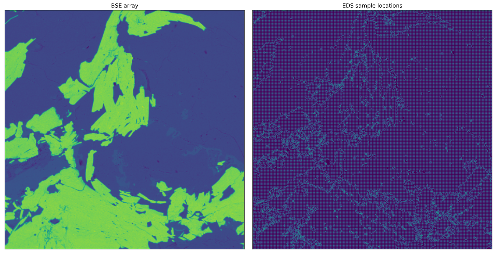

# graph-segmentation

Code for paper _Graph-based Deep Learning Segmentation of EDS Spectral Images for Automated Mineralogy Analysis_
__Submitted to Computers and Geosciences.__ We will add the link to the paper after publication.

_This research was supported by Technology Agency of the Czech Republic project BOREC: Colour Image in "Realtime Embedded Computing", TH0301033 and the TESCAN company._

If you have any questions regarding the method, data or the implementation, please fill an [issue](https://github.com/RomanJuranek/graph-segmentation/issues).

# Contents

The repository contains a package `tima` for Python (version 3.6 or newer required) which implements the segmentation method and reading data from Tescan data files.

We provide trained network - `models/embedding.h5` and an example field - `data/example/field-1`.

Be sure to install the packages in `requirements.txt` we tested the code with them. However, there should be no problems if you use more recent versions.

# Example

See [notebook](example.ipynb) for segmentation of the example field. The results sould look like this:

BSE array of the example field and locations of EDS measurements.

Segmentation result for different parameters:
