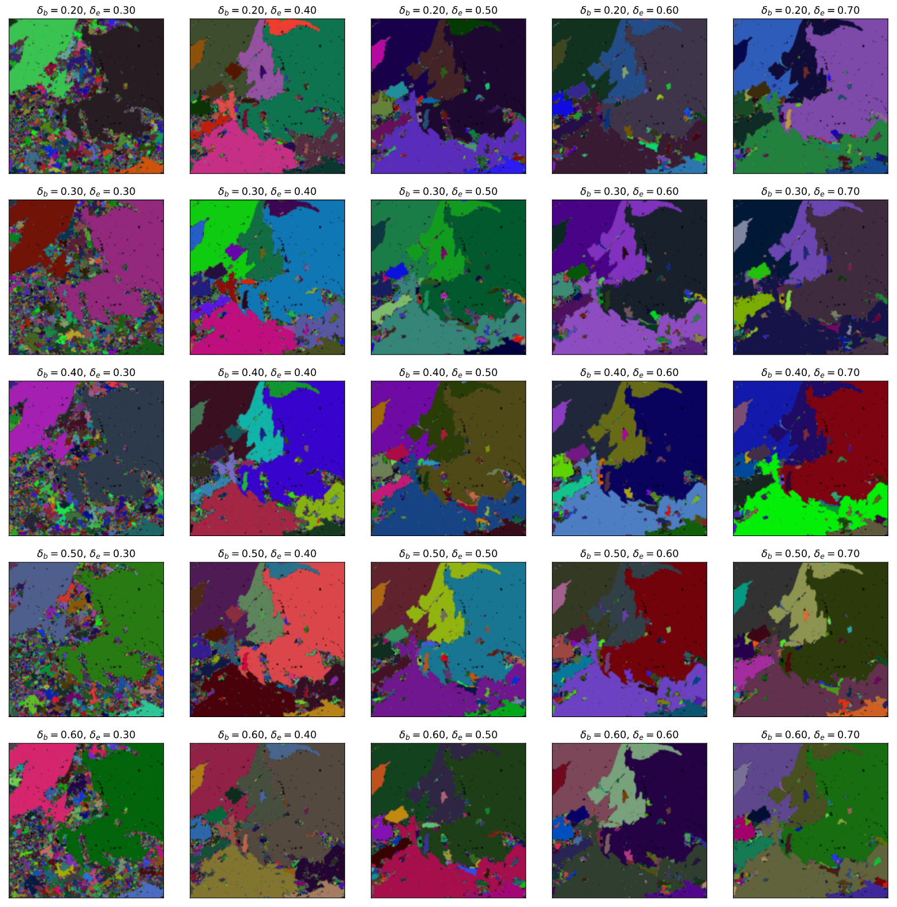

# graph-segmentation

Code for paper _Graph-based Deep Learning Segmentation of EDS Spectral Images for Automated Mineralogy Analysis_
__Submitted to Computers and Geosciences__

_This research was supported by Technology Agency of the Czech Republic project BOREC: Colour Image in "Realtime Embedded Computing", TH0301033 and the TESCAN company._

# Contents

The repository contains a package `tima` for Python which implements the segmentation method and reading data from Tescan data files.

We provide trained network - `models/embedding.h5` and an example field - `data/example/field-1`.

Be sure to install the packages in `requirements.txt` we tested the code with them. However, there should be no problems if you use more recent versions.

# Example

See [notebook](example.ipynb) for segmentation of the example field.





If you find the paper or the code useful in your research, please cite.

```bibtex
@article{juranek2020graph,
  title={Graph-based Deep Learning Segmentation of EDS Spectral Images for Automated Mineralogy Analysis},
  author={Juránek, R. and Výravský, J. and Kolář, M. and Motl, D. and Zemčík, P.},
  journal={Computers and Geosciences},
  year={2020}
}
```